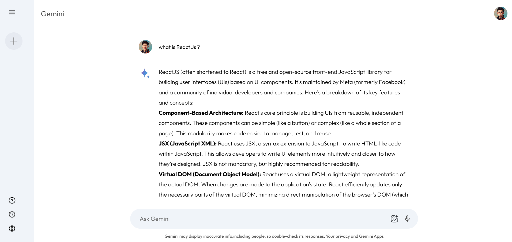

# Application Screenshot

<h1>Gemini-clone</h1>

Gemini-clone is a lightweight and minimalistic browser project replicating the functionality of the Gemini protocol, designed for a privacy-respecting and distraction-free web experience. This project demonstrates a clean user interface and efficient design for seamless browsing of Gemini links.

<h2>Features</h2>
<ul>
  <li> <strong>Simple text input interface</strong> for easy user interaction.</li>
  <li> <strong>Real-time response retrieval</strong> from the Gemini API.</li>
  <li> <strong>Clean and intuitive design</strong> for a seamless user experience.</li>
  <li> <strong>Efficient processing</strong> for fast and reliable results.</li>
</ul>

<h2>Technologies Used</h2>
<ul>
  <li> <strong>React.js</strong> - For building the user interface.</li>
  <li> <strong>JavaScript</strong> - For handling the application logic and API interactions.</li>
  <li> <strong>CSS</strong> - For styling and layout design.</li>
</ul>

<h2>Installation</h2>
<ol>
  <li>Clone the repository:
    <pre><code>git clone https://github.com/yourusername/gemini-clone.git</code></pre>
  </li>
  <li>Navigate to the project directory:
    <pre><code>cd gemini-clone</code></pre>
  </li>
  <li>Install the dependencies:
    <pre><code>npm install</code></pre>
  </li>
  <li>Create a `.env` file in the root of the project and add your Gemini API key:
    <pre><code>VITE_GOOGLE_API_KEY=your_api_key_here</code></pre>
  </li>
  <li>Start the development server:
    <pre><code>npm start</code></pre>
  </li>
</ol>
